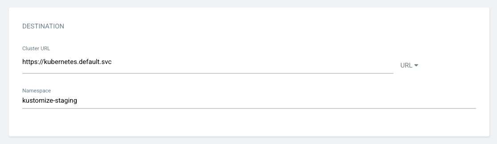
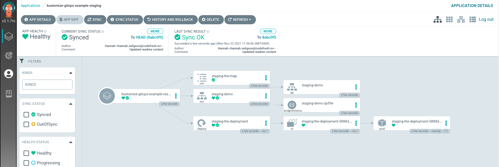
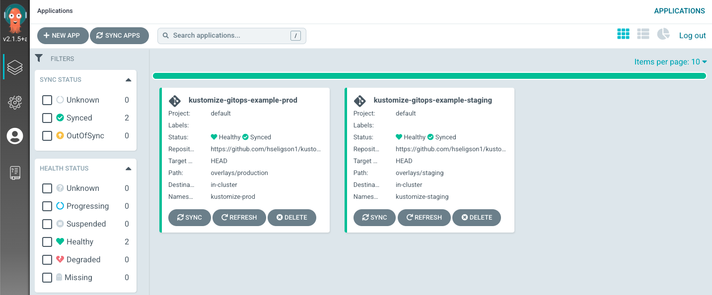
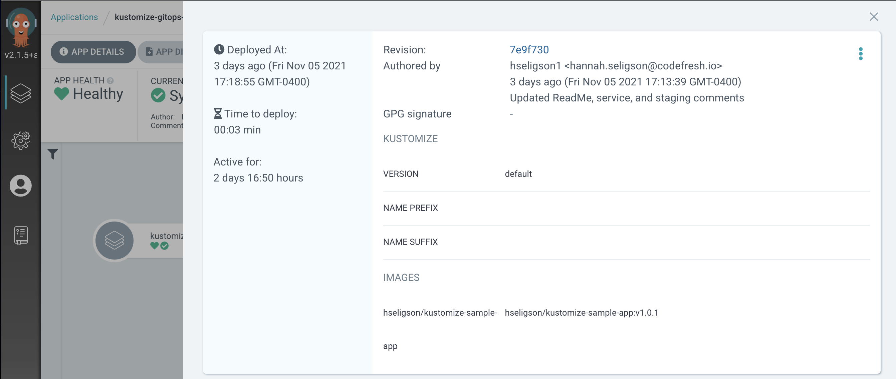
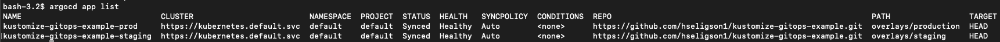
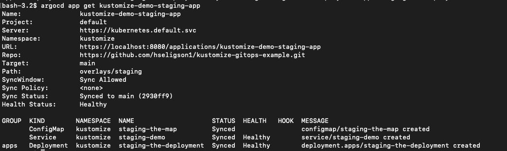
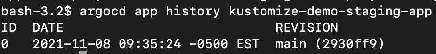

# Applied GitOps with ArgoCD and Kustomize

This is a sample web application that includes both a base and overlays folder with a `kustomization.yaml` file and `config-map.yaml` file, to deploy in Staging and Production environments. We'll explain 2 ways to deploy this application using both Kustomize and ArgoCD to a specific environment.

## Prerequisites

- Access to a Kubernetes cluster
- Install [Kustomize](https://kubectl.docs.kubernetes.io/installation/kustomize/)
- Install and configure [Argo CD's CLI and server component](https://argo-cd.readthedocs.io/en/stable/). Please refer to Argo's [documentation](https://argoproj.github.io/argo-cd/getting_started/) to get started.

## Deploy with Kustomize

We will install and deploy this application using only Kustomize. The `kustomization.yaml` file already exists within this application, so we don't need to create or add this YAML file. Start by cloning the repository to your local environment.

`git clone https://github.com/hseligson1/kustomize-gitops-example.git`

This application's structure includes:

```
kustomize-gitops-example
├── app
├── base
│   ├── configMap.yaml
│   ├── deployment.yaml
│   ├── kustomization.yaml
│   └── service.yaml
└── overlays
    ├── production
    │   ├── config-map.yaml
    │   ├── deployment.yaml
    │   └── kustomization.yaml
    └── staging
        ├── config-map.yaml
        └── kustomization.yaml
```

Next, configure the cluster with overlays using this command:

`kustomize build kustomize-gitops-example/overlays/staging`

or

`kustomize build kustomize-gitops-example/overlays/production`

This allows you to review the data for both environments. You should see an output similar to this staging overlay response:

```
apiVersion: v1
data:
  mysqlDB: staging-mysql.example.com:3306
kind: ConfigMap
metadata:
  labels:
    app: demo
    variant: staging
  name: staging-the-map
---
apiVersion: v1
kind: Service
metadata:
  labels:
    app: demo
    variant: staging
  name: staging-demo
spec:
  ports:
  - port: 8080
  selector:
    app: demo
    variant: staging
  type: ClusterIP
---
apiVersion: apps/v1
kind: Deployment
metadata:
  labels:
    app: demo
    deployment: demo
    variant: staging
  name: staging-the-deployment
spec:
  replicas: 1
  selector:
    matchLabels:
      app: demo
      variant: staging
  template:
    metadata:
      labels:
        app: demo
        deployment: demo
        variant: staging
    spec:
      containers:
      - env:
        - name: MY_MYSQL_DB
          valueFrom:
            configMapKeyRef:
              key: mysqlDB
              name: staging-the-map
        image: hseligson/kustomize-sample-app:v1.0.1
        imagePullPolicy: Always
        name: the-container
        ports:
        - containerPort: 8080
```
Once you've reviewed the overlays, create a new namespace for the staging environment with a `kubectl` command: 

`kubectl create namespace kustomize-staging`

and

`kubectl create namespace kustomize-prod`

Make sure you're on the namespace:

`kubectl config set-context --current --namespace=kustomize-staging`

Then, apply any changes to the cluster and deploy with a `kubectl` command:

`kubectl apply -k kustomize-gitops-example/overlays/staging`

or

`kubectl apply -k kustomize-gitops-example/overlays/production`

This returns a response informing you if either environment contains the changes and is deployed. Here's the staging environment example: 
```
configmap/staging-the-map created
service/staging-demo created
deployment.apps/staging-the-deployment created
```
To inspect the deployment and confirm whether or not it's READY, you can execute the command:

`kubectl get deployment staging-the-deployment`

or

`kubectl get deployment production-the-deployment`

or inspect the service by the namespace:

`kubectl get pods -n kustomize-staging`

Fore more details, you can also execute:

`kubectl describe pods <pod name>`

## Deploy with Kustomize and ArgoCD

Now, that you've deployed your app with Kustomize, let's review how to do the same with ArgoCD. 
Assuming you've installed and configured ArgoCD already, now you can log into ArgoCD and access the UI.

### Deploy with ArgoCD UI

Navigate to the +NEW APP on the left-hand side of the UI. Then add the following below to create the application.

#### General Section:

- Application Name – This is the application name inside ArgoCD. Enter "kustomize-gitops-example"

- Project – This is the project name inside ArgoCD. Since this is a new setup for ArgoCD, a default project is created for us and we’ll select the same.

- Sync Policy – You can choose to auto synchronize the state of application in the Kubernetes with the GitHub repository. Choose "Enable".


#### Source Section:

- Repository URL – Provide the url for the GitHub repository containing the application manifests. This is the HTTPS URL for this project.

- Revision – You can choose to provide the specific branch or tag for github repo and sync the same state with Kubernetes details. We’ll choose, "main" or you can keep the default, "HEAD".

- Path – This helps in further segregating application manifests inside the GitHub repository. Select the overlays folder based on environment, "overlays/staging". 
- Note: You can do this for the production environment by repeating these steps and creating another new ArgoCD application. You would simply select "overlays/production" for the path.


#### Destination Section:

- Cluster URL – ArgoCD can be used to connect and deploy application to multiple Kubernetes clusters. Choose the default in-cluster (where Argo CD itself is deployed).

- Namespace – This can be used to select namespace where manifests will be deployed. You can choose a custom namespace and provide the same. Also, you’ll need to create the namespace on the target Kubernetes cluster before you can deploy manifests to it. Add "kustomize-staging" or "kustomize-prod" if you created a namespace prior within this tutorial. It's best practice to create custom namespaces for each environment.



#### Kustomize Section 

ArgoCD will read the `kustomization.yaml` file in the path and will prompt you to override with different values. However, we’ll go with the default configuration committed in the github repo.


#### Synchronize: 

Afterwards, it will read the parameters and the Kubernetes manifests. The application will be OutOfSync, because it hasn’t deployed yet and no Kubernetes resources are created. You can then SYNC the application using the default options. Once the manifests are applied, you can review the application health and resources you deployed.

**Include image of healthy application**

Once the manifest is applied, you can review the application health and the resources deployed. Below is an example of both environments: Staging and Production applications that are deployed and healhy.



- Note: within this demo we walked you through how to create an ArgoCD application for your Kustomize project for a staging environment. You can repeat this process for other environments like development, production, testing, etc.



If you need to rollback or view your history for an application due to any errors or issues, you can do so by click on the HISTORY/ROLLBACK button within the UI to view the deployment history. Included is also a revision ID that will link you directly to the Git repo commit. 



Congrats, you've deployed an application with Kustomize and applied GitOps with ArgoCD.

### Deploy with argocd CLI

Assuming you're connected to your Kubernetes cluster and logged into the argocd CLI, we can begin deploying the Kustomize application.

First, to login to the CLI:

`argocd login localhost:8080 --username admin --password <same password used in argocd ui>`

This will return a response that lists your ArgoCD applications. You should see the app we created within the UI, "kustomize-gitops-example-staging".



Otherwise you can create an ArgoCD application through the argocd CLI. To do this you can create a namespace for the cluster:

`kubectl create ns kustomize-staging`

Next, deploy the `kustomization.yaml` file within the CLI and reference the Git repository to create the ArgoCD app:

`argocd app create <application name> --repo https://github.com/hseligson1/kustomize-gitops-example.git --revision main --path overlays/staging  --dest-server https://kubernetes.default.svc --dest-namespace kustomize-staging`

This will return a resonse, "application 'kustomize-demo-staging-app' created". Next, sync the deployment managed by ArgoCD:

`argocd app sync <application name>`

This will return a response that allows you to view the application you created and whether or not you were able to synchronize or not.


Check status of deployment:

`argocd app get <application name>` 



### ArgoCD Application History

In case you need to rollback the ArgoCD application, you can do so by rolling back the application to a previously deployed version by the History ID. First, you need access to the application deployment history:

`argocd app history <application name>`



The response will return the application history, including an ID, date, and branch that any revision was made on the application. You can then use the ID to rollback the application to a specific deployed version:

`argocd app history <application name> <application history id>` 

As previously mentioned, each time a new `kustomize.yaml` file is added or modified, ArgoCD will detect those changes and update the deployments.
