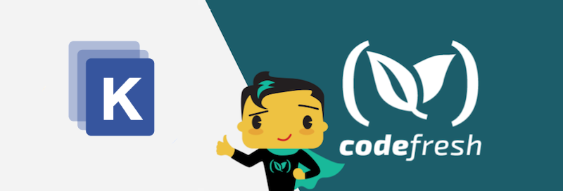

# Deploy to Kubernetes with Kustomize

This is a sample web application that uses Kustomize to deploy to different environments (production and staging).

## Deploy Locally

To deploy locally (with kubectl 1.14+), run the following:

`kubectl apply -k overlays/staging`

`kubectl apply -k overlays/production`

If using an older version of kubectl, use:

`kustomize build overlays/staging | kubectl apply -f`

`kustomize build overlays/production | kubectl apply -f`

## Deploy with Codefresh

There are two YAML files procided, `staging-codrefresh.yml` and `prod-codefresh.yml` for easy usage with the Codefresh CI/CD platform.  For more information, see the [Codefresh documentation](https://codefresh.io/docs/docs/yaml-examples/examples/deploy-with-kustomize/).
