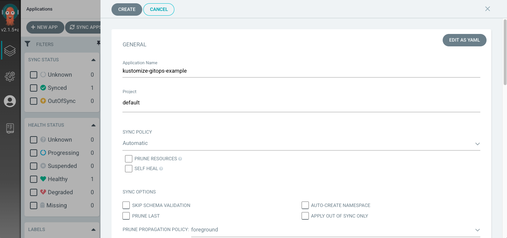
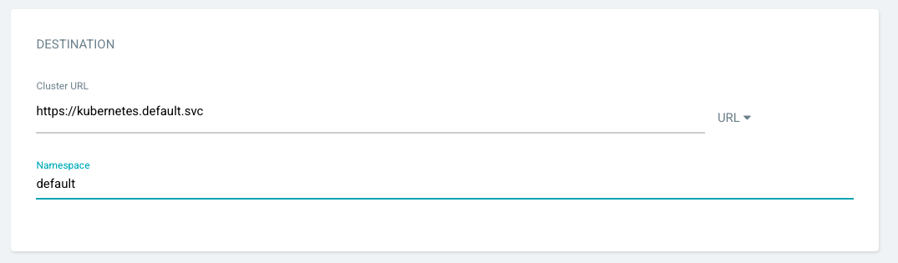
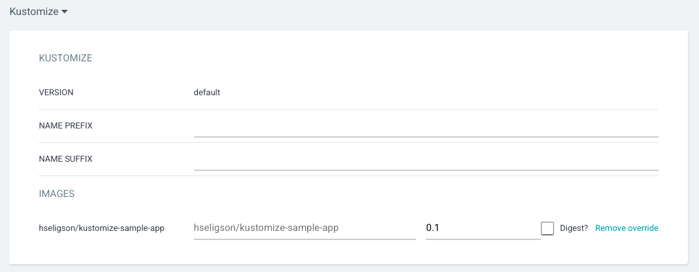

# Applied GitOps with ArgoCD and Kustomize

This is a sample web application including a kustomization.yaml file, using Kustomize. We'll explain 2 ways to deploy this application using both Kustomize and ArgoCD.

## Prerequisites

- Access to a Kubernetes cluster
- Install [Kustomize](https://kubectl.docs.kubernetes.io/installation/kustomize/)
- Install and configure [Argo CD's CLI and server component](https://argo-cd.readthedocs.io/en/stable/). Please refer to Argo's [documentation](https://argoproj.github.io/argo-cd/getting_started/) to get started.

## Deploy with Kustomize

We will install and deploy this application using Kustomize. This kustomization.yaml file already exists within this application, so we don't need to create or add this YAML file. Start by cloning the repository to your local environment.

`git clone https://github.com/codefresh-contrib/kustomize-gitops-example`

After you create a cluster and have access to it, this application's structure includes:

```
kustomize-gitops-example
├── app
├── base
│   ├── configMap.yaml
│   ├── deployment.yaml
│   ├── kustomization.yaml
│   └── service.yaml
└── overlays
    ├── production
    │   ├── config-map.yaml
    │   ├── deployment.yaml
    │   └── kustomization.yaml
    └── staging
        ├── config-map.yaml
        └── kustomization.yaml
```
Then, configure the cluster with overlays using this command:

`kustomize build overlays/staging`

`kustomize build overlays/production`

This allows you to review the data for both environments. You should see an output similar to this staging overlay response:

```
apiVersion: v1
data:
  mysqlDB: staging-mysql.example.com:3306
kind: ConfigMap
metadata:
  labels:
    app: demo
    variant: staging
  name: staging-the-map
---
apiVersion: v1
kind: Service
metadata:
  labels:
    app: demo
    variant: staging
  name: staging-demo
spec:
  ports:
  - port: 8080
  selector:
    app: demo
    variant: staging
  type: LoadBalancer
---
apiVersion: apps/v1
kind: Deployment
metadata:
  labels:
    app: demo
    deployment: demo
    variant: staging
  name: staging-the-deployment
spec:
  replicas: 1
  selector:
    matchLabels:
      app: demo
      variant: staging
  template:
    metadata:
      labels:
        app: demo
        deployment: demo
        variant: staging
    spec:
      containers:
      - env:
        - name: MY_MYSQL_DB
          valueFrom:
            configMapKeyRef:
              key: mysqlDB
              name: staging-the-map
        image: hseligson/kustomize-sample-app:latest
        name: the-container
        ports:
        - containerPort: 8080
```
Once you've reviewed the overlays, then you can apply any changes to the cluster and deploy with a `kubectl` command:

`kubectl apply -k overlays/staging`

`kubectl apply -k overlays/production`

This returns a response informing you if either environment contains the changes and is deployed. Here's the staging environment example: 
```
configmap/staging-the-map unchanged
service/staging-demo unchanged
deployment.apps/staging-the-deployment configured
```
To inspect the deployment and whether it's READY, you can execute the command:

`kubectl get deployment staging-the-deployment`

`kubectl get deployment production-the-deployment`

or inspect the service with the `default` namespace:

`kubectl get pods --namespace default`

Fore more details, execute:

`kubectl describe pods <pod name>`

## Deploy with Kustomize and ArgoCD

Now, that you've deployed your app with Kustomize, let's review how to do the same with ArgoCD. 
Assuming you've installed and configured ArgoCD already, now you can log into ArgoCD and access the UI.

### Deploy with ArgoCD UI

Navigate to the +NEW APP on the left-hand side of the UI. Then add the following to create the application.

#### General Section:

- Application Name – This is the application name inside ArgoCD. Enter "kustomize-gitops-example"

- Project – This is the project name inside ArgoCD. Since this is a new setup for ArgoCD, a default project is created for us and we’ll select the same.

- Sync Policy – You can choose to auto synchronize the state of application in the Kubernetes with the GitHub repository. Choose "Enable".



#### Source Section:

- Repository URL – Provide the url for the GitHub repository containing the application manifests. This is the HTTPS URL for this project.

- Revision – You can choose to provide the specific branch or tag for github repo and sync the same state with Kubernetes details. We’ll choose, "main".

- Path – This helps in further segregating application manifests inside the GitHub repository. Select, "base".


#### Destination Section:

- Cluster URL – ArgoCD can be used to connect and deploy application to multiple Kubernetes clusters. Choose the default in-cluster (where Argo CD itself is deployed).

- Namespace – This can be used to select namespace where manifests will be deployed. You can choose a custom namespace and provide the same. Also, you’ll need to create the namespace on the target Kubernetes cluster before you can deploy manifests to it. We’ll leave it as "default" for now.



#### Kustomize Section 

ArgoCD will read the `kustomization.yaml` file in the path and will prompt you to override with different values. However, we’ll go with the default configuration committed in the github repo.



#### Synchronize: 

Afterwards, it will read the parameters and the Kubernetes manifests. The application will be OutOfSync, because it hasn’t deployed yet and no Kubernetes resources are created. You can then SYNC the application using the default options. Once the manifests are applied, you can review the application health and resources you deployed.

**Include image of healthy application**

Once the manifest is applied, you can review the application health and the resources deployed. 

Congrats, you've deployed an application with Kustomize and applied GitOps with ArgoCD.

### Deploy with argocd CLI

Assuming you're connected to your Kubernetes cluster and logged into ArgoCD, we can begin deploying the Kustomize application.

First, create a namespace for the cluster:

`kubectl create ns kustomize`

Next, deploy the `kustomization.yaml` file within the CLI and reference the Git repository to create an ArgoCD app:


`argocd app create <application name> --repo <repo url> --revision <source branch> --path <folder containing kustomization> --dest-server <server url> --dest-namespace <namespace>`

Sync deployment managed by ArgoCD:

`argocd app sync <application name>`

**include screenshot**

Check status of deployment:

`argocd app get <application name>` 

**include screenshot**

As previously mentioned, Each time a new `kustomize.yaml`  file is added or modified, ArgoCD will detect those changes and update the deployments.


